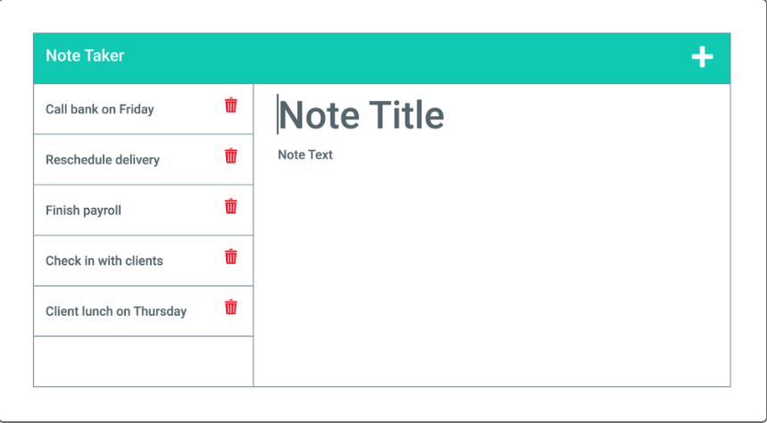
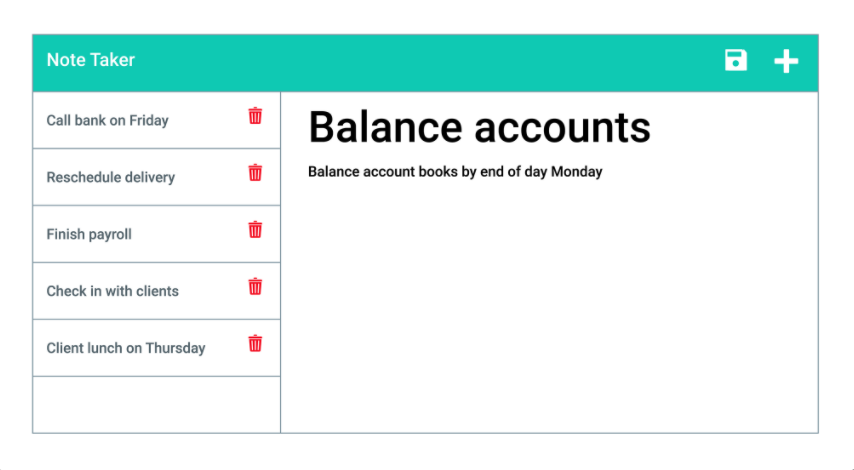

# Express.js-Note-Taker

## Table of Contents
* Descriptipon
* User Story
* Acceptance Criteria
* Installation
* Website
* Screenshots
* Badges
* Contact

## Description:
This application is called Note Taker. It can be used for note taking as well as saving notes and will retrieve and save note data generasted by the user from the JSON file. I will be connecting the BackEnd to this FrontEnd application, joining the two and then deploy the completed application to Heroku. 

## User Story
AS A small business owner. 
I WANT to be able to write and save notes to be as organized as possible. 
SO THAT I can organize my thoughts and keep track of tasks I need to complete. Make and keep my clients happy because I have taken care of them professionally and thus eraned their loyalty as committed customers.

## Acceptance Criteria
GIVEN a note-taking application
WHEN I open the Note Taker
THEN I am presented with a landing page with a link to a notes page
WHEN I click on the link to the notes page
THEN I am presented with a page with existing notes listed in the left-hand column, plus empty fields to enter a new note title and the note’s text in the right-hand column
WHEN I enter a new note title and the note’s text
THEN a Save icon appears in the navigation at the top of the page
WHEN I click on the Save icon
THEN the new note I have entered is saved and appears in the left-hand column with the other existing notes
WHEN I click on an existing note in the list in the left-hand column
THEN that note appears in the right-hand column
WHEN I click on the Write icon in the navigation at the top of the page
THEN I am presented with empty fields to enter a new note title and the note’s text in the right-hand column

## Installation
You can begin by downloading [Nodejs](https://nodejs.org/en/download/) to your computer.

## Website
[Note Taker](https://pure-ocean-52127.herokuapp.com/notes)

## Screenshots

## Badges

## Contact
[Mianta McKnight](https://github.com/RogueStorm7/Express.js-Note-Taker.git)

&copy; 2022 Mianta McKnight  | All rights reserved | 
